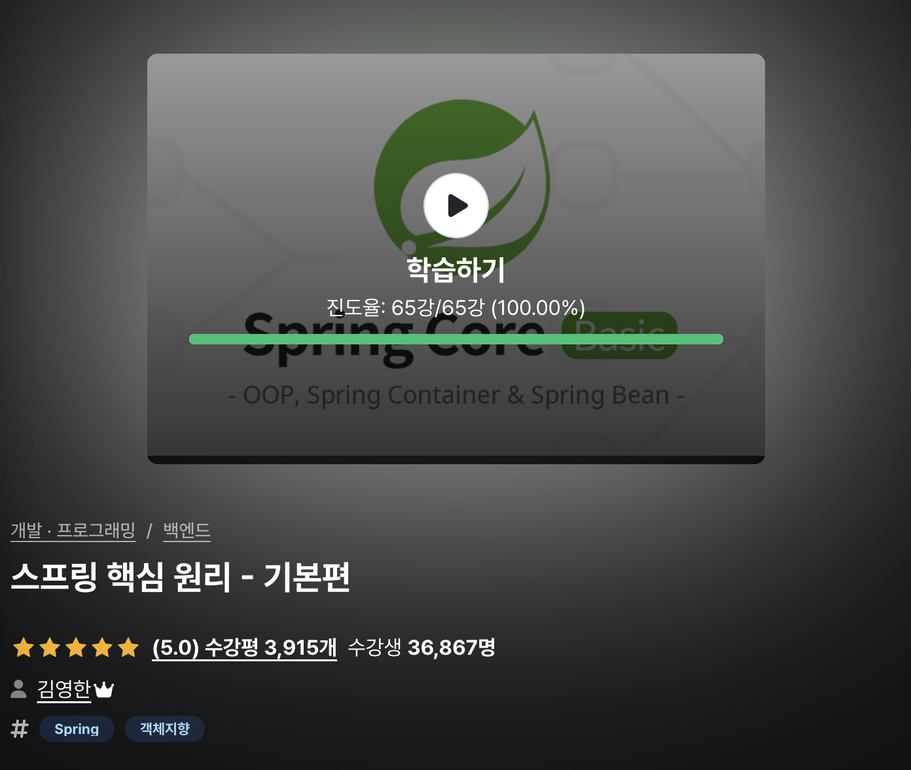

# `inflearn-spring--core-basic`

인프런 [스프링 핵심 원리 - 기본편, 김영한](https://www.inflearn.com/course/%EC%8A%A4%ED%94%84%EB%A7%81-%ED%95%B5%EC%8B%AC-%EC%9B%90%EB%A6%AC-%EA%B8%B0%EB%B3%B8%ED%8E%B8/dashboard)
강의를 듣고 정리한 내용입니다.

    

- [View scripts on Velog](https://velog.io/@jbw9964/series/spring-core-basic)

---

## 🔖 Folder Description

| `Folder`  | `Content`                                       |
|:---------:|:------------------------------------------------|
| `scripts` | 공부한 내용이 `markdown` 으로 정리된 폴더입니다.                |
| `assets`  | 공부하며 첨부 또는 제작한 이미지가 저장된 폴더입니다.                  |
|   `app`   | 공부하며 실습한 소스코드 `module` 입니다. `(Gradle - Groovy)` |

---

## 📌 공부 내용 정리 목록

- ### [Section 02. 좋은 객체지향 설계의 5 원칙](./scripts/section-02/좋은-객체-지향-설계의-5가지-원칙.md)
- ### [Section 03 • 04. 예제 만들기](./scripts/section-03-04/README.md)
- ### [Section 05. 스프링 컨테이너와 스프링 빈](./scripts/section-05/README.md)
- ### [Section 07. 컴포넌트 스캔](./scripts/section-07/README.md)
- ### [Section 08. 의존관계 자동 주입](./scripts/section-08/README.md)
- ### [Section 10. 빈 스코프](./scripts/section-10/README.md)

---

## 💬 학습 회고

[스프링 핵심 원리 - 기본편](https://www.inflearn.com/course/%EC%8A%A4%ED%94%84%EB%A7%81-%ED%95%B5%EC%8B%AC-%EC%9B%90%EB%A6%AC-%EA%B8%B0%EB%B3%B8%ED%8E%B8/dashboard)
은 `Spring Boot` 를 이용해 웹 어플리케이션을 만들기 **전**, `Spring` 자체를 간단히 이해하기 위한 강의입니다.

강의는 `IoC Container`, `Dependency Injection`, `Bean Scope` 등 **`Spring`** 의 정말 중요한 기초를 설명합니다.
강의 중 가장 인상깊었던 내용은 **`Strategy Pattern` 을 이용한 `Bean` 선택 실행** 이었습니다.

사실 이전 [`Spring Starts Here`](https://github.com/jbw9964/Spring_Starts_Here) 를 공부했기에 새로운 내용을 배우진
않았지만, `왜 Spring 을 사용하는가?` 를 다시 느낄 수 있었던 학습이었습니다.

---