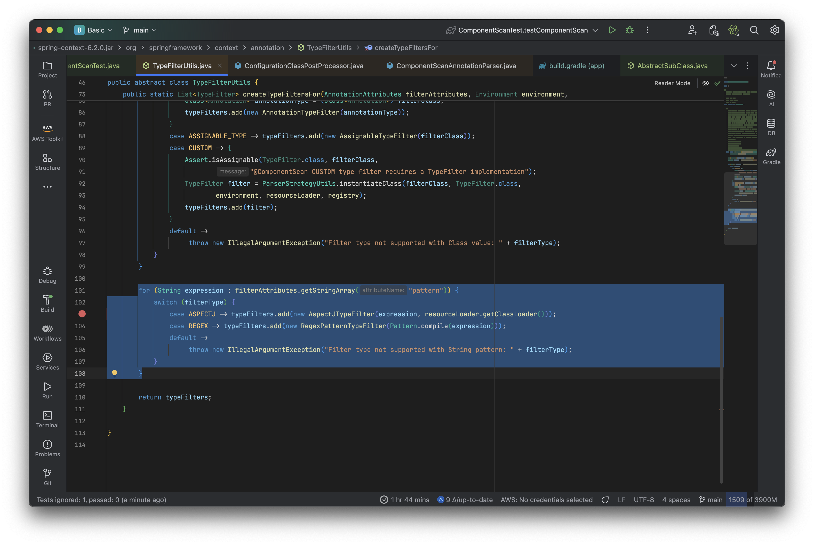
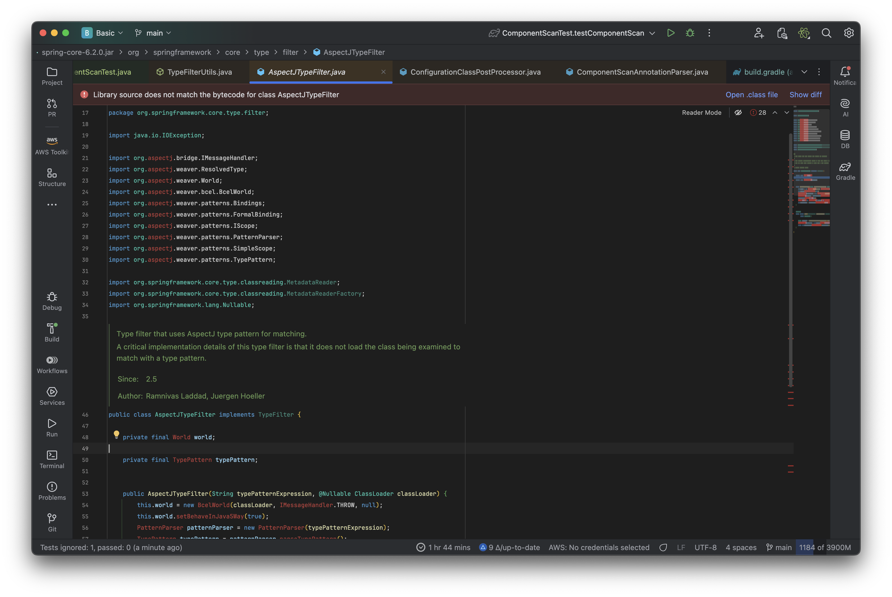

# Section 07 - 컴포넌트 스캔

---

`@ComponentScan` 자체는 원래 알고 있던 내용이지만 `basePackageClasses`, `Filter` 등 몰랐던 내용이 있어 간단히 정리하고자 한다.

일단 `@ComponentScan` 자체는 아래처럼 구성되어 있다.

```java
package org.springframework.context.annotation;

@Retention(RetentionPolicy.RUNTIME)
@Target(ElementType.TYPE)
@Documented
@Repeatable(ComponentScans.class)
public @interface ComponentScan {

    Class<?>[] basePackageClasses() default {};

    Filter[] includeFilters() default {};

    Filter[] excludeFilters() default {};

    /* ... 생략 ... */

}
```

`basePackageClasses` 는 `basePackage` 랑 거의 동일한데, 어느 클래스가 속한 package 를 `basePackage` 로 지정해주는 속성이기
때문이다.

또한 `includeFilters`, `excludeFilters` 는 `@ComponentScan` 이 클래스를 포함, 제외할 filter 를 설정하는 속성이다.

참고로 `@Filter` 어노테이션은 `@ComponentScan` 속에 `Nested interface` 로 정의되어 있다.

`(Java SE 에 따르면 중첩 인터페이스는 클래스, 인터페이스 body 에 존재하는 인터페이스이다. 꼭 클래스 내부에 있어야 '중첩 인터페이스' 라 부르는 건 아니다.)` [`[1]`](#reference)

```java
public @interface ComponentScan {

    @Retention(RetentionPolicy.RUNTIME)
    @Target({})
    @interface Filter {

        FilterType type() default FilterType.ANNOTATION;

        @AliasFor("classes")
        Class<?>[] value() default {};

        @AliasFor("value")
        Class<?>[] classes() default {};

        String[] pattern() default {};
    }
}
```

`FilterType` 은 `Enum` 상수로 정의되어 아래처럼 분류된다.

> `FilterType`
> - `ANNOTATION` : 특정 어노테이션을 기반으로 필터를 구성
> - `ASSIGNABLE_TYPE` : 클래스, 인터페이스 등의 타입을 기반으로 필터를 구성
> - `ASPECTJ`, `REGEX` : `AspectJ`, 정규표현식 등 패턴을 기반으로 필터를 구성
> - `CUSTOM` : 사용자가 직접 만든 `FilterType` 을 통해 필터를 구성
    >
    >    ```java
    > public enum FilterType {
    > ANNOTATION,
    > ASSIGNABLE_TYPE,
    > ASPECTJ, REGEX,
    > CUSTOM
    > }
    >    ```

이를 이용해 아래처럼 `"특정 어노테이션이 붙은 개체를 Bean 생성에서 제외"` 하는 등 좀 더 유연한 동작이 가능하다.

~~`(물론 정말로 사용할 일이 있는지는 몰?루)`~~

```java

@Target(ElementType.TYPE)
@Retention(RetentionPolicy.RUNTIME)
@interface MyExclusion {

}

@Configuration
@ComponentScan(
        includeFilters = @Filter(type = FilterType.ASSIGNABLE_TYPE, classes = AbstractSupClass.class),
        excludeFilters = @Filter(type = FilterType.ANNOTATION, classes = {MyExclusion.class})
)
class Config {

}
```

---

조금 더 테스트하다 알게 된 사실인데, **`FilterType.ASPECTJ` 를 이용하려면 실제 `AspectJ` 라이브러리가 있어야 작동**하는 걸 발견했다.

처음엔 클래스 `weaving time` 차이로 인한 문제일 줄 알았는데 `spring-core` 라이브러리를 디버깅하다 정확한 원인을 발견했다.

`(Spring 기본은 RTW, AspectJ 는 CTW 또는 LTW 로 기억한다.)`

`@ComponentScan` 의 `excludeFilters` 혹은 `includeFilters` 를 사용하면 `TypeFilterUtils`
의 `createTypeFiltersFor` 메서드가 호출된다.

- [`TypeFilterUtils#createTypeFiltersFor`](https://github.com/spring-projects/spring-framework/blob/373763723ee7dcc9dd39c9cba7e1ed093966360f/spring-context/src/main/java/org/springframework/context/annotation/TypeFilterUtils.java#L101C3-L107C5)

<!-- TypeFilterUtils.png -->

<p align="center">
  
</p>

이 때 `FilterType` 에 따라 알맞게 filter 를 생성하는데, `FilterType.ASPECTJ` 이면 새로운 `AspectJTypeFilter` 를 생성하려고
한다.

- [`AspectJTypeFilter`](https://github.com/spring-projects/spring-framework/blob/373763723ee7dcc9dd39c9cba7e1ed093966360f/spring-core/src/main/java/org/springframework/core/type/filter/AspectJTypeFilter.java#L21C1-L31C42)

<!-- AspectJTypeFilter.png -->

<p align="center">
  
</p>

그런데 `AspectJTypeFilter` 를 보면 실제 `org.assertj` 에 사용되는 `World`, `TypePattern` 이 필요함을 볼 수 있고, 이 때문에
실제 `AspectJ` 라이브러리가 필요하다.

즉, 아래처럼 만들어야 `FilterType.ASPECTJ` 를 사용할 수 있다.

```gradle
// build.gradle

dependencies {
    /* ... */

    implementation 'org.springframework.boot:spring-boot-starter-aop'
    
    // starter-aop 에는 애초에 aspectj:aspectjweaver 를 depends on 한다.
    // aspectj 라이브러리도 같이 딸려온다는 소리.
}
```

```java

@Configuration
@ComponentScan(
        excludeFilters = @Filter(type = FilterType.ASPECTJ, pattern = "*..SomeClass")
)
public class TestConfig {

}
```

하지만 풀리지 않는 의문점이 존재하는데, **"왜 `FilterType.ASPECTJ` 를 안 사용했을 때는 잘 작동하는가?"** 이다.
결국 문제가 되는 이유는 `TypeFilterUtils` 에서 `AspectJTypeFilter` 를 사용하려 하고, `AspectJTypeFilter` 에는 `AspectJ`
라이브러리를 필요로 하기 때문이었다.

따라서 애초에 build 시 `AspectJTypeFilter` 를 필요로 할 것이고, `AspectJTypeFilter` 를 컴파일 하는 과정에서 `AspectJ` 라이브러리가
없어 에러가 발생해야 한다.

하지만 확인해보니 정말 이상하게 `FilterType.ASPECTJ` 를 사용했을 때만 build 실패가 발생하고 사용하지 않았을땐 실패하지 않는다.

혹시 `Spring` 의 `Dependency Management` 가 `Runtime` 에 행해지는지 확인하려 했지만 정확한 공식 문서를 잘 찾지 못했다.

일단 내가 무언가 놓쳤을 지도 모르므로 한번 `Spring-framework` 깃헙에 해당
문제를 [`issue`](https://github.com/spring-projects/spring-framework/issues/34135) 로 물어본 상태이다.
뭔가 새롭게 알게 된 내용이 있다면 추가하겠다.

---

## Reference

- [`Chapter 9. Interfaces - Java Specification`](https://docs.oracle.com/javase/specs/jls/se23/html/jls-9.html)
    - `[1]` : A nested interface is any interface whose declaration occurs within the body of
      another class or interface declaration.
      A nested interface may be a member interface `(§8.5, §9.5)` or a local interface `(§14.3)`.

---