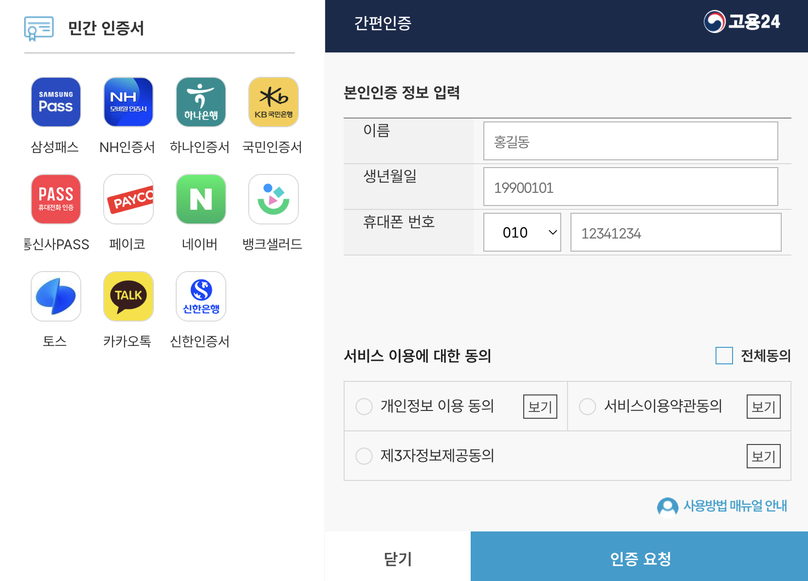

# Section 08 - 의존관계 자동 주입

---

이번 섹션은 `Spring` 에서 가능한 `DI` 방법을 설명한다. 사실 이들은 이전에 전부 공부했던 내용이라 생략하려 했지만, 강의 도중에 아주 괜찮은 내용 2 가지가 있어
정리하고자 한다.

---

## I. 어노테이션을 이용한 `DI`

`Spring` 을 사용할 때 종종 `@Qualifier`, `@Value` 등 을 이용해 `DI` 해야할 때가 존재한다.

`(Service 에 따라 다른 RedisTemplate 를 사용한다든지, 다양한 DiscountPolicy 중 하나를 선택한다든지 등...)`

```java

@Configuration
public class DuplicateBeanConfig {

    /**
     * Refresh 토큰을 위한 Redis Template
     */
    @Bean
    @Qualifier("refreshTokenTemplate")
    public RedisTemplate<String, Object> refreshTokenRedisTemplate() {
        /* ... */
    }

    /**
     * 뭔가 다른걸 위한 Redis Template
     */
    @Bean
    @Qualifier("otherTemplate")
    public RedisTemplate<String, Object> someOtherRedisTemplate() {
        /* ... */
    }
}
```

하지만 위 코드에서 문제는 `@Qualifier` 의 속성 `(refreshTokenTemplate, otherTemplate)` 은 오직 `Runtime` 시에만 확인 가능하다는
점이다.

때문에 강의에서는 다음처럼 필요한 어노테이션을 만들어 `type-safety` 를 챙기는 방법을 제시한다.

```java

@Target({ElementType.TYPE, ElementType.METHOD})
@Retention(RetentionPolicy.RUNTIME)
@Qualifier("Anything that are not duplicated")
@interface RefreshTokenTemplate {

}

@Target({ElementType.TYPE, ElementType.METHOD})
@Retention(RetentionPolicy.RUNTIME)
@Qualifier("Non-duplicated qualifier")
@interface OtherTemplate {

}
```

```java

@Bean
@RefreshTokenTemplate
public RedisTemplate<String, Object> refreshTokenRedisTemplate() {
    /* ... */
}

/**
 * 뭔가 다른걸 위한 Redis Template
 */
@Bean
@OtherTemplate
public RedisTemplate<String, Object> someOtherRedisTemplate() {
    /* ... */
}
```

이러면 `@Qualifier` 확인을 `Compile-time` 에 확인할 수 있다.

사소하지만 아주 좋은 습관이다.

---

## II. `Map` 을 이용한 `Bean` 선택

서비스의 형태에 따라 다르겠지만 가끔 `의도적으로 해당 타입의 Bean 이 모두 필요한 경우` 가 있을 수 있다.

나는 이에 대한 적절한 예시가 `민간 인증서 서비스` 라고 생각한다.

<p align="center">
    
</p>

사용자가 인증을 할 때, 위 인증 수단 중 어떤 것을 사용할지는 동적으로 결정되어야 한다.

```java

@Service
@RequiredArgsConstructor
public class CertificationService {

    KakaoCertification kakao;
    TossCertification toss;
    PassCertification pass;
    NaverCertification naver;

    public void certifyUser(
            User user, CertifyMethod method
    ) {
        switch (method) {
            case KAKAO:    /* ... */
            case TOSS:     /* ... */
            case PASS:     /* ... */
            case NAVER:    /* ... */
        }
    }
}
```

그런데 이를 위 예시처럼 한 클래스에 몽땅 집어넣어 사용하면 `한 클래스의 코드가 너무 길어지고 유지보수가 어려워` 질 수 있다.

강의는 위같은 상황에서 `Strategy` 패턴에 기반한 `Bean` 선택을 제시한다.

- 인증 타입과 전략 패턴을 위한 interface

    ```java
    enum CertificationType {
        KAKAO, NAVER, PASS, TOSS
    }
    
    interface Certification {
        void doCertification();
        CertificationType getCertificationType();
    }
    ```

- 실제 인증 구현체와 인증 서비스

```java

@Component
class KakaoCertification implements Certification {

    @Override
    public void doCertification() {
        System.out.println("I'm kakao certification");
    }

    @Override
    public CertificationType getCertificationType() {
        return CertificationType.KAKAO;
    }
}

/* ... 나머지 구현체는 생략 ... */

@Service
class CertificationService {

    private final Map<CertificationType, Certification> certifications;

    public CertificationService(List<Certification> certifications) {
        this.certifications = certifications.stream()
                .collect(Collectors.toMap(
                        Certification::getCertificationType, Function.identity()
                ));
    }

    public void doCertification(CertificationType type) {
        certifications.get(type).doCertification();
    }
}
```

위처럼 구성할 경우 어떤 새로운 인증 방식이 추가되어도 `CertificationService` 를 고칠 필요가 없으며, 각 구현체별 코드가 나눠져 있으므로 유지보수가 용이해진다.

이런 방식은 생각조차 못했는데 역시 현업자는 보는 눈부터 다르구나 싶었다.

> 여담이지만 위 전략패턴 이용한 예시를 만들던 중 `@MockBean`, `@SpyBean` 차이로 인한 트러블 슈팅을 경험했다.
>
> [`velog`](https://velog.io/@jbw9964/Troubleshooting-MockBean-%EA%B3%BC-SpyBean) 에 간단히 정리해 두었다.

---
